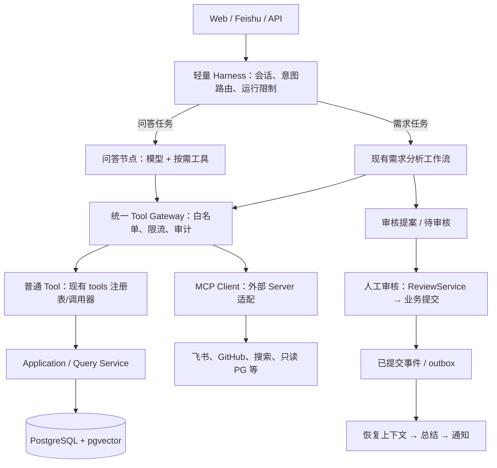
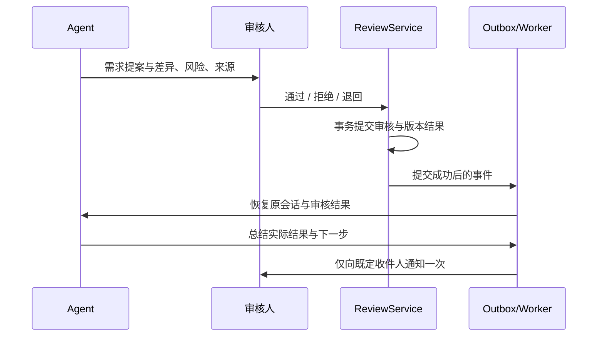

# Requirement Agent 精简升级计划书

版本：2026-09-23；范围：架构与实施计划，不代表已完成接入。

## 1. 目标与边界

把现有项目升级为“通用问答入口 + 需求治理工作流 + 可控的外部 MCP 工具”的 Agent Harness。用户可以询问普通知识、按需联网，也可以提交、检索、合并和迭代需求。正式需求版本仍只由人工审核后的 `ReviewService` 提交；审核结果回到 Agent 生成总结，再通知用户。

本轮不推倒重写，不迁移原有业务数据库，不以 MCP 取代 Repository，不让模型执行正式业务写入。不预先建设独立任务总线、四套记忆库、通用 SQL 写工具或七个新的专职 Agent。

## 2. 已有基础与实际差距

| 方面 | 仓库现状 | 本次处理 |
| --- | --- | --- |
| 业务 | FastAPI、需求来源/版本/审核、SQLAlchemy + PostgreSQL + pgvector、既有 outbox | 保留 |
| Agent | 抽取、检索、分析、风险 Agent；已有 `skills/` | 复用，暂不复制为新业务 App |
| LangGraph | 分析图固定顺序；审核图根据审核结果条件分支 | 外围增加意图路由、工具调用循环和审核恢复 |
| 内部工具 | `tools/base.py`、`registry.py`、`invoker.py` 已有只读注册校验、消费方白名单、三态结果与审计 | 原样保留业务查询边界 |
| 对外能力 | 缺通用问答的独立路由和本项目自己的 MCP Client 接入层 | 小范围新增 |

现有 `ReviewService.submit_decision()` 持有数据库事务，调用审核决策图并负责提交/回滚。新流程必须以**事务提交成功**为“审核已完成”的唯一业务事实，不能在工具层或模型侧仿造审批。

## 3. 升级后架构



**边界**：`Tool Gateway` 统一向模型展示“此轮允许的工具”，不是把现有 `tools/registry.py` 改成可注册写工具。业务查询继续走普通 Tool；外部系统走 MCP Client；正式业务写入仍由审核 API → `ReviewService` → 既有审核图/Repository 执行。

## 4. 普通 Tool 与 MCP Tool 怎么放

```text
src/requirement_agent/
  tools/                    # 现有普通 Tool：需求业务只读查询；保留 base/registry/invoker
  integrations/mcp/         # 新增：MCP 客户端生命周期、服务配置、工具适配
    client.py               # stdio / Streamable HTTP 连接、发现和调用
    catalog.py              # 外部工具名、schema、服务来源的映射
    policy.py               # 主机侧白名单、角色/场景、参数与输出约束
  harness/
    runtime.py              # 一轮运行的意图、上下文、步数/时间预算
    tool_gateway.py         # 统一暴露 Tool 描述与调用分发
  workflows/
    assistant_graph.py      # 新增：问答 / 需求意图路由与有界工具循环
    review_resume.py        # 新增：审核完成后续跑总结
  application/
    ...                     # 继续使用 RequirementService / ReviewService / outbox
```

| 入口 | 存放位置 | 示例 | 谁能调用 | 写入范围 |
| --- | --- | --- | --- | --- |
| 普通业务 Tool | 现有 `tools/` | `search_requirements`, `preview_merge_impact` | 指定消费方的分析图/问答节点 | 无正式写入，保持 `read_only=True` |
| 外部 MCP Tool | 外部 Server；本项目只存客户端适配与准入规则 | `mcp.brave.brave_web_search`, `mcp.github.issue_read` | Gateway 按任务、身份授权后分发 | 默认只读；个别外部副作用走专门业务动作 |
| 业务命令 | 现有 API/Application Service | `ReviewService.submit_decision()` | 审核人或受控系统流程 | 按事务提交正式需求数据 |

统一展示名采用 `local.<name>` / `mcp.<server>.<tool>`，防止同名冲突；内部保持原有 `tools.invoker.invoke()`，不要批量改旧调用点。Gateway 把普通 Tool 的 `ToolResult` 与 MCP `CallToolResult` 规范成 `{status, data, source, duration_ms, error}`；MCP 的 `isError` 和超时映射为 `error`，有效空结果映射为 `empty`。业务上的“检索失败”不能当作“查无相似需求”。

每轮只向模型提供与意图有关的少量工具 schema 和检索片段，不附整库数据、所有 MCP 服务清单、密钥或完整聊天历史。例如普通 Python 知识问答通常不调工具；技术方案需要新资料才暴露搜索；查询历史需求暴露现有业务 Tool；管理报表请求且有权限才考虑 PG MCP。MCP Server 自报的工具描述和 `readOnlyHint` 只是输入，不替代本项目的 allowlist、数据库权限和审核规则。

MCP Client 采用 Python MCP SDK；本地 Server 可走 stdio，已有远程部署可走 Streamable HTTP，具体按各实现支持情况选择。避免把异步、可能长时间运行的 MCP 会话塞进现有 `BaseTool.run()` 的线程超时机制；Gateway 对两类工具采用各自执行适配，统一结果和审计即可。

## 5. 七类 MCP 接入清单

| 能力 | 候选实现与首批开放能力 | 默认部署与限制 |
| --- | --- | --- |
| PostgreSQL | 评估维护中的 `crystaldba/postgres-mcp`：表结构、只读分析/报表。旧 `@modelcontextprotocol/server-postgres` 已归档，不作为生产默认选型 | 管理/报表场景专用；`restricted` 模式 + 独立最小权限只读账号 + 允许访问的 schema/视图 + 行数/超时限制；正常需求问答仍走业务 Tool；绝不连接可写账号 |
| Feishu / Lark | 官方 `larksuite/lark-openapi-mcp`：按权限读取消息和文档；审核后发送结果通知 | 入站消息优先复用既有回调/事件接收并记录来源，不依赖模型轮询 MCP；`message.create` 仅供受控通知动作使用，不向通用问答开放任意收件人发送 |
| GitHub | 官方 `github/github-mcp-server`：读取仓库、issue、PR、提交与代码片段，绑定需求来源 | 首期只开必要的只读工具/权限；创建或修改 issue/PR 属外部副作用，需要单独确认与幂等策略 |
| Web Search | 官方 `brave/brave-search-mcp-server`：首期仅网页搜索 | 缺新近知识或用户明确联网时调用，输出 URL、标题、摘要和检索时间；限制次数与结果数 |
| Filesystem | `@modelcontextprotocol/server-filesystem`：限定目录读取文档 | 默认关闭；启用时只读挂载 + 允许路径 + 只暴露读取工具；该 Server 本身也有写/移动/删除工具，不可整包开放；文件导出由受控应用服务处理 |
| Vector DB | 当前已有 `pgvector`，先沿用现有语义检索 Tool；需要独立向量服务时可评估 Qdrant 官方 MCP，Milvus 需另做选型 | 默认关闭；Qdrant 如启用需 `QDRANT_READ_ONLY` 且限定集合；不要与现有 pgvector 建双写、双索引“第二事实源” |
| Playwright | 官方 `microsoft/playwright-mcp`：前端工作台回归和页面验收 | 默认仅开发/CI 环境，限制可访问主机，不把浏览器控制工具开放给生产用户聊天 |

以上七类都提供接入位和启停配置，但**接入位不等于全部默认运行、更不等于全部暴露给 LLM**。Server 的工具名/版本在安装验收时以实际 `list_tools` 为准，锁定经测试的版本，避免运行期自动升级改变权限面。

## 6. 任务如何处理

| 用户任务 | 图/节点 | 工具选择 | 结果 |
| --- | --- | --- | --- |
| “Python 有哪些知识点？” | 问答节点 | 直接回答，必要时才搜索 | 不写入需求表 |
| “查一下最新 LangGraph 审核方案” | 问答节点 | Brave Search MCP | 带来源与时间的回答 |
| “REQ-001 当前版本改了什么？” | 现有业务查询路径 | 普通需求 Tool | 查询现有版本及来源 |
| “把飞书文档中的需求合并进去” | Feishu 文档获取 → 现有提取/分析图 | Feishu MCP + 普通检索 Tool | 形成 proposal，等待审核 |
| “关联 GitHub issue 说明实现进度” | 问答/需求来源整理 | GitHub 只读 MCP | 给出 issue/PR 引用，不自行修改版本 |
| “做个需求统计报表” | 受权报表节点 | 优先现有 Query Service；探索型分析才使用只读 PG MCP | 有边界的聚合结果，不让模型直连可写业务库 |

最小 Agent 分工：现有抽取/检索/分析/风险 Agent 继续负责需求；新增一个问答 Agent/节点负责通用问答和选择外部工具；最外层用规则 + 必要的 LLM 意图识别决定入口。联网搜索不是必须单独造一个 Agent；审核后的总结也是恢复图中的一个节点。后续确有跨任务协作需求，再拆 Supervisor + 子 Agent，不预先引入多 Agent 通讯成本。

LangGraph 增加 `assistant_graph` 的条件路由与有界工具循环（例如步数上限、超时和失败退出），但现有需求分析图保持固定顺序，因为提取 → 检索 → 分析 → 风险是业务依赖，不需要模型任意跳过。命中正式写入时始终退出到人工审核。

## 7. 审核后恢复与总结



在外围会话图使用 LangGraph checkpointer + `thread_id` 保存等待审核的上下文，按官方 `interrupt()` / `Command(resume=...)` 思路恢复；不重造通用 `checkpoint` 表。审核 API 仍由现有 `ReviewService` 处理，事务成功之后通过已有 outbox 或其提交后事件触发恢复，不能在数据库提交前发消息或把外部 MCP 调用放进业务事务。恢复输入必须来自已落库的审核结果及 `source_id`、`requirement_key`、版本号、审核意见，而不是模型复述的“已批准”。

Worker 对 `(review_id, event_type)` 做幂等处理；重复回调不重复提交版本、不重复通知。批准后总结版本与变更，拒绝后总结原因，退回后说明需补充的信息。通知失败可重试但不回滚已提交的需求版本；总结失败留可重试状态。原审核提案与最终落库差异需要可追溯。

## 8. 权限、数据与故障边界

1. **工具准入**：工具清单由主机侧固定 allowlist 决定，按 `user/role/intent/consumer` 过滤；不相信服务器自报的“只读”标签。生产环境显式关闭写类 MCP Tool。
2. **数据最小化**：只把必要的查询、片段送给外部服务；飞书私聊和业务库原文需按身份鉴权，防止跨用户/跨租户检索。搜索/文档/issue 内容视为不可信资料，不能把其中的指令当系统命令。
3. **凭据隔离**：独立飞书应用权限、GitHub 只读授权、Brave API Key、PG 只读账号；密钥只在服务端配置，不进入提示词、MCP 参数或审计日志。
4. **数据库隔离**：PostgreSQL MCP 不承担需求 CRUD。只读账号、可访问视图、`statement_timeout`、结果行数限制与只读事务同时设置；敏感生产数据优先通过脱敏视图或报表副本。
5. **超时与审计**：记录 `run_id`、规范工具名、状态、耗时、结果量和脱敏参数摘要；不落整份消息/文件内容。检索异常要显式失败或在审核界面标注“未完成检索”，不能静默当无冲突。
6. **外部副作用**：向飞书发送消息、创建 GitHub issue/PR 不是“只读”。即使不写需求表，也由明确的业务动作控制收件人、目标、权限和幂等键。

## 9. 实施顺序与验收

| 阶段 | 做什么 | 验收标准 |
| --- | --- | --- |
| P0：统一入口 | 新建轻量 runtime、`Tool Gateway`、MCP Client/allowlist；不改已有 Tool 注册表与旧 API | 旧需求提交、检索、审核测试不变；普通 Tool/MCP 名称不冲突；未授权工具不可见也不可直接调用 |
| P1：首批外部工具 | 接 Brave、Feishu、GitHub；PG 限定为管理/报表只读；配置开关与凭据隔离 | 普通问答不写需求；联网回答带来源；能读取授权飞书文档/GitHub issue；PG 尝试写入被数据库权限拒绝 |
| P2：图与审核恢复 | 增加意图路由、有限工具循环、Postgres-backed LangGraph checkpointer；沿用 `ReviewService` + outbox 恢复总结 | 人工通过/拒绝/退回均给出与真实结果一致的总结；重复事件不重复提交/通知；失败可恢复 |
| P3：按需扩展 | Filesystem 限定读取、Playwright 开发验证；Vector 接口保留但默认仍用 pgvector | 禁止读允许目录之外文件；Playwright 不出现在生产用户 Tool 清单；原向量索引无双写 |
| P4：有证据再扩展 | 复用现有 `skills/`；需要跨 Agent/跨服务协作再加多 Agent/A2A；“自进化”先仅生成可审阅的改进建议 | 有具体多步骤用例、权限模型、失败处理与评测数据后才上线；Agent 不自行修改生产 Skill、Prompt 或业务规则 |

**第一批自动化测试**：无工具问答、意图误判回退、MCP 连接失败/超时、越权工具调用、只读 PG 写入拒绝、飞书/搜索内容提示注入、审核事务回滚、审核事件重复投递、通知失败重试；端到端覆盖“飞书文档 → 分析提案 → 人工审核 → 正式版本 → Agent 总结 → 飞书通知”。

## 10. 明确不做的事

- 不新增 `apps/requirements` 复制当前业务目录；待模块边界稳定后再考虑迁移。
- 不把 `execute_sql`、`commit_requirement`、`approve_review` 放进普通 Tool 注册表。
- 不给所有用户常驻七类 MCP、全表结构、全部原始文档；按任务和身份按需暴露。
- 不在 P0 建 `agent_session`、`agent_event`、`skill_version`、`a2a_task` 等整套新表；先复用现有事件/outbox，LangGraph 使用自身 checkpointer 表，缺口出现再加表。
- 不因“要多 Agent”而把搜索、总结、文件读取各包装成独立 Agent；不让自进化自动发布业务逻辑。

## 11. 参考实现与文档

- 当前仓库：[README](https://github.com/wmy-me/Requirement_agent/blob/master/README.md)、[工具注册表](https://github.com/wmy-me/Requirement_agent/blob/master/src/requirement_agent/tools/registry.py)、[工具调用器](https://github.com/wmy-me/Requirement_agent/blob/master/src/requirement_agent/tools/invoker.py)、[LangGraph 图](https://github.com/wmy-me/Requirement_agent/blob/master/src/requirement_agent/workflows/graphs.py)、[ReviewService](https://github.com/wmy-me/Requirement_agent/blob/master/src/requirement_agent/application/review_service.py)。
- MCP 客户端：[Python SDK](https://py.sdk.modelcontextprotocol.io/client/)；安全边界：[MCP Tool Annotations](https://blog.modelcontextprotocol.io/posts/2026-03-16-tool-annotations/)。
- 服务实现：[PostgreSQL 候选](https://github.com/crystaldba/postgres-mcp)、[旧 PostgreSQL 参考实现（归档）](https://github.com/modelcontextprotocol/servers-archived/blob/main/src/postgres/README.md)、[Feishu/Lark](https://github.com/larksuite/lark-openapi-mcp)、[GitHub](https://github.com/github/github-mcp-server)、[Brave Search](https://github.com/brave/brave-search-mcp-server)、[Filesystem](https://github.com/modelcontextprotocol/servers/blob/main/src/filesystem/README.md)、[Qdrant](https://github.com/qdrant/mcp-server-qdrant)、[Playwright](https://github.com/microsoft/playwright-mcp)。
- 审核恢复：[LangGraph interrupts](https://docs.langchain.com/oss/python/langgraph/interrupts)、[persistence](https://docs.langchain.com/oss/python/langgraph/persistence)。
