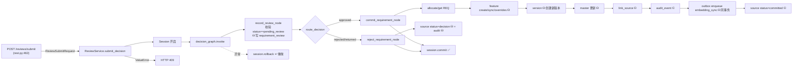
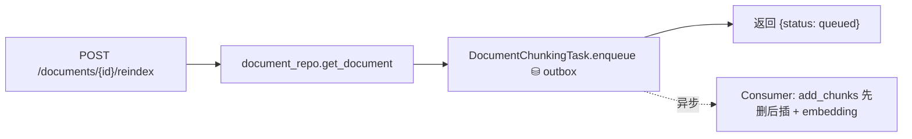

# 复杂 API 路由只读分析（第 3.3 阶段第一步）

> 生成日期：2026-09-11 ｜ 依据：当前工作区实际代码 ｜ **本阶段只读，未修改任何代码**
> 说明：以当前代码实际路由为准。任务描述中提到的 `POST /api/v1/files/upload`、
> `POST /api/v1/documents/ingest` **在现有代码中不存在**（见 §0 更正）。

## 0. 与实际代码的偏差更正

| 任务描述中的路径 | 实际情况 |
|---|---|
| `POST /api/v1/files/upload` | **不存在**。文件上传由 `POST /api/v1/requirements/ingest`（multipart，`file: UploadFile`）承担 |
| `POST /api/v1/documents/ingest` | **不存在**。文档入库同样走 `POST /api/v1/requirements/ingest` |
| `POST /api/v1/documents/reindex` | 实际为 `POST /api/v1/documents/{document_id}/reindex` |

其余路径与代码一致。

---

## 1. 候选路由表

> 类型：写=会写库；读=只读；流=SSE。
> 事务：`强`=单一显式事务边界（有 rollback）；`分散`=多段各自治会话；`outbox`=异步入队；`-`=无。

| 路由 | 函数（文件:行） | 类型 | 写库 | LLM | 外部服务 | 事务 | 是否适合迁移 |
|---|---|:--:|:--:|:--:|---|:--:|---|
| POST `/api/v1/requirements/submit` | `submit_requirement`（rest.py:80） | 写 | 是（经 service） | 是（extract/analyze/risk） | DB、DeepSeek | 分散 | ✅ 可安全迁移（接口薄） |
| POST `/api/v1/requirements/ingest` | `ingest_requirement`（rest.py:108） | 写 | 是（source+document+outbox） | 是（经 service） | **MinIO**、DB、DeepSeek | 分散 + outbox | ⚠️ 需拆分后迁移 |
| POST `/api/v1/documents/{id}/reindex` | `reindex_document_chunks`（rest.py:269） | 写 | 是（经 outbox） | 否（embedding 在 worker） | DB | outbox | ✅ 可安全迁移（接口薄） |
| POST `/api/v1/reviews/submit` | `submit_review_decision`（rest.py:462） | 写 | 是 | 否 | DB | **强**（ReviewService） | ✅ 已于 3.3.3 迁移至 `api/routes/reviews.py`（submit_router） |
| POST `/api/v1/agent/run` | `run_agent_pipeline`（agent_chat.py:445） | **读** | **否** | 是 | DeepSeek | - | ✅ 已于 3.3.2 迁移至 `api/routes/agent.py` |
| POST `/api/v1/agent/chat` | `chat_with_agent`（agent_chat.py:470） | 写 | 是（会话/消息） | 是 | DB、DeepSeek | 分散 | ⚠️ 需先设计内部 Tool |
| POST `/api/v1/agent/chat/stream` | `stream_agent_chat`（agent_chat.py:519） | 流 | 是（会话/消息/run） | 是（含流式 narrative） | DB、DeepSeek | 分散 | ❌ 暂不迁移（SSE） |
| POST `/api/v1/agent/chat/stream-with-files` | `stream_agent_chat_with_files`（agent_chat.py:533） | 流 | 是 | 是 | DB、DeepSeek | 分散 | ❌ 暂不迁移（SSE） |
| GET `/api/v1/agent/chat/{session_id}` | `get_agent_chat_history`（:565） | 读 | 否 | 否 | - | - | ✅（只读） |
| GET `/api/v1/agent/runs/{run_id}` | `get_agent_run`（:571） | 读 | 否 | 否 | - | - | ✅（只读） |
| GET/POST `/api/v1/conversations` | `list/create_conversation`（rest.py:282/289） | 读/写 | POST 是 | 否 | DB | 分散 | ✅ 已于 3.3.4 迁移（`api/routes/conversations.py`） |
| GET/POST `/api/v1/conversations/{id}/messages` | `get/add_conversation_message`（:297/307） | 读/写 | POST 是 | 否 | DB | 分散 | ✅ |
| PATCH/DELETE `/api/v1/conversations/{id}` | `update/delete_conversation`（:323/339） | 写 | 是 | 否 | DB | 分散 | ✅ |
| POST `/api/v1/conversations/{id}/finalize` | `finalize_conversation`（:349） | 写 | 是（摘要+记忆） | 是（摘要+记忆抽取） | DB、DeepSeek | 分散 | ⚠️ 需拆分后迁移 |
| GET/POST `/api/v1/memory` | `list/upsert_memory`（:369/376） | 读/写 | POST 是 | POST 是（embedding） | DB、oneapi | 分散 | ⚠️ 需拆分后迁移 |
| GET `/api/v1/memory/context` | `get_memory_context`（:414） | 读 | 否 | 是（embedding 召回） | oneapi | - | ✅（只读，含外部调用） |
| POST `/api/v1/memory/{id}/delete` | `delete_memory`（:404） | 写 | 是（软删） | 否 | DB | 分散 | ✅ |

**关键结论**：候选“复杂”路由中，**接口层真正繁重的只有 3 个**——`ingest_requirement`（文件+存储+分析+outbox）、SSE 三个流式端点、`finalize_conversation`/`upsert_memory`（内联 LLM/embedding）。其余多为“薄转发”。

---

## 2. 复杂路由依赖图

### 2.1 需求提交（submit）—— 无强事务，分散会话

```mermaid
flowchart LR
  A["POST /requirements/submit<br/>(rest.py)"] -->|参数→RequirementSource| B[RequirementService.submit_requirement]
  B --> C[RequirementSourceRepository.save<br/>⛁ 独立会话 commit]
  C --> D[run_analysis LangGraph]
  D --> E1[ExtractAgent→ExtractSkill→LLM]
  D --> E2[RetrievalAgent→RetrievalService]
  D --> E3[AnalyzeAgent→AnalyzeSkill→LLM]
  D --> E4[RiskAgent→RiskSkill→LLM]
  D --> E5[decide_node→decision_rules]
  D --> F[update_extraction ⛁ / update_status(pending_review) ⛁]
  A -->|响应| G[RequirementSubmitResponse]
```
- 接口层职责：Pydantic 解析 + 组装 `RequirementSource`（含 `idempotency_key`）+ 组装响应。
- 应用服务职责：保存、清洗分段、跑分析图、回填 metadata、置 `pending_review`。
- **事务**：`save` / `update_extraction` / `update_status` **各自独立会话**，无跨步骤统一事务（异常中断会留下中间态，幂等键可兜底重入）。
- **不触发 outbox**（embedding 在审核通过时才入队）。

### 2.2 审核提交（reviews/submit）—— 唯一强事务边界


- **事务边界**：`ReviewService` 持有 session；**整个决策图在同一事务内提交一次**；异常整体回滚。这是全项目唯一强事务边界。
- **副作用**：创建版本、创建审核记录、写审计、**入队 outbox（embedding 同步，与业务同事务）**。
- 接口层极薄：仅转发 + 捕获 `ValueError→409`。

### 2.3 文件上传与文档处理（ingest）—— 同步链路长，部分异步

```mermaid
flowchart TD
  A["POST /requirements/ingest<br/>(rest.py)"] --> B[file.read]
  B --> C[DocumentParser.parse<br/>pdf/docx/图片OCR 同步]
  C --> D[ObjectStorage.upload → MinIO（同步·外部）]
  D --> E[组装 merged_text]
  E --> F[RequirementService.submit_requirement<br/>LLM 分析 同步]
  F --> G[DocumentAssetRepository.save ⛁ document_asset]
  G --> H[DocumentChunkingTask.enqueue ⛁ outbox]
  H --> I[DocumentChunkingTask.process_pending(1)<br/>同步消费一次：切块+embedding]
  I -.其余事件.-> J[Consumer/Worker 异步消费<br/>切块/embedding]
  F --> K[source status=pending_review]
  subgraph 异步
    J
  end
```
- **同步**：读文件、解析、MinIO 上传、LLM 分析、写 document_asset、入队 outbox、同步消费 1 条。
- **异步**：其余 outbox（embedding/分片）由 `consumer`/`worker` 消费。
- **不能直接迁到 API 层的部分**：MinIO 上传（`object_storage`）、文档解析（`document_parser`）、向量化（在 chunk task 内）——应下沉到应用服务/基础设施，由接口层只做编排。

### 2.4 reindex（薄 outbox 触发）



### 2.5 Agent Chat / SSE —— 流式生命周期 + 线程/队列

```mermaid
flowchart TD
  A["POST /agent/chat/stream"] --> B[_resolve_chat_context<br/>幂等找/建会话]
  B --> C{_try_replay<br/>client_message_id 幂等?}
  C -->|已完成 run| D[回放 SSE: session/artifacts/narrative/done]
  C -->|新请求| E[_stream_chat_pipeline]
  E --> F[upsert_user_message ⛁ + create_run ⛁]
  F --> G[run_in_threadpool: extract→retrieve→analyze→risk]
  G --> H["SSE: session/step*/artifacts"]
  H --> I[_narrative_chunks]
  I --> J["线程池 _pump → LLM generate_stream（同步 httpx）"]
  J --> K["stdlib Queue → 事件循环轮询 get_nowait + sleep(0.05)"]
  K --> L["SSE: narrative 分片"]
  L --> M[append_assistant_message ⛁ + update_run(completed) ⛁]
  E -.CancelledError.-> N[update_run(cancelled) ⛁]
  E -.异常.-> O["SSE error + update_run(failed) ⛁"]
```
- **流式生命周期**：`StreamingResponse(text/event-stream)` 包裹异步生成器；事件类型 `session/step/artifacts/narrative/done/error`。
- **后台线程/异步**：`loop.run_in_executor(None, _pump)` 在线程池跑同步 `httpx.stream`；用 stdlib `Queue` 跨线程传递，事件循环非阻塞轮询。
- **Agent 状态**：`pipeline` dict（extracted/candidates/analysis/risk/review_required/next_action）随 `artifacts` 事件下发。
- **narrative**：`LLMProvider.generate_stream`（`NARRATIVE_SYSTEM_PROMPT`），失败回退 `_fallback_narrative`。
- **记忆写入**：流式**不写**长期记忆；记忆仅由 `finalize_conversation` 触发。
- **文件上下文截断**：`MAX_FILE_CHARS = 6000`（`_collect_files`，agent_chat.py:46）。
- **SSE 断开**：`asyncio.CancelledError` → `update_run(cancelled)`。
- **错误**：`Exception` → SSE `error` + `update_run(failed)`。
- **是否依赖 MCP**：**否**（agent_chat 不 import MCP；与 MCP 仅共享 Application Service）。

---

## 3. 迁移优先级

### P0：可以安全迁移（接口层薄、无文件/流式、单调用）
- `POST /api/v1/requirements/submit` — 仅参数→`RequirementSource`→service。
- `POST /api/v1/reviews/submit` — 仅转发 `ReviewService` + `ValueError→409`（**注意保持强事务语义由 service 持有**）。
- `POST /api/v1/documents/{document_id}/reindex` — 仅 `get_document` + `enqueue`。
- conversations CRUD：`list/create/update/delete_conversation`、`get/add_conversation_message`。
- `POST /api/v1/memory/{memory_id}/delete` — 仅 `update_status`（软删）。
- Agent 只读：`GET /agent/chat/{session_id}`、`GET /agent/runs/{run_id}`、`POST /agent/run`（纯分析无副作用）。

### P1：需要拆分后迁移（接口层混入业务/外部调用）
- `POST /api/v1/requirements/ingest` — 接口内混有文件读取/解析/MinIO 上传/同步消费，需先下沉到应用服务（建议 `DocumentIngestService`）或内部 Tool。
- `POST /api/v1/conversations/{id}/finalize` — 内联 `summarize_text`(LLM) + `memory_extractor`(LLM)，需下沉到 service。
- `POST /api/v1/memory`（upsert）— 内联 embedding 调用，需下沉到 service。
- `GET /api/v1/memory/context` — 内联向量召回，可下沉。

### P2：需要先设计内部 Tool
- `POST /api/v1/agent/chat`（非流式对话） — 依赖 Agent 编排 + 会话落库；作为内部 Tool 时需界定“分析”与“落库”边界。

### P3：暂不迁移
- `POST /api/v1/agent/chat/stream`、`POST /api/v1/agent/chat/stream-with-files` — SSE 生命周期 + 线程/队列 + 幂等回放，**建议整模块迁移（`routes/agent_chat.py`），不拆分**，且迁移前应完成 3.3 的服务边界设计。

---

## 4. 建议目标路径

| 当前路径 | 建议目标路径 | 迁移方式 | 兼容策略 | 风险 |
|---|---|---|---|---|
| POST /requirements/submit（rest.py） | `api/routes/requirements_write.py` | 原样迁移（薄转发） | rest.py include + 转发函数名 | 低 |
| POST /requirements/ingest（rest.py） | `api/routes/files.py`（拆分后） | 拆分后迁移（文件处理下沉 service） | 同上；须保持 multipart 契约 | 高 |
| POST /documents/{id}/reindex（rest.py） | `api/routes/files.py` | 原样迁移 | 同上 | 低 |
| POST /reviews/submit（rest.py） | `api/routes/reviews.py`（同文件追加） | 原样迁移 | 同上；须保持 409 与强事务 | 中 |
| conversations CRUD（rest.py） | `api/routes/conversations.py` | 原样迁移 | 同上 | 低 |
| memory 读/写（rest.py） | `api/routes/memory.py` | 读原样；写拆分后 | 同上 | 中 |
| agent 全部（agent_chat.py） | `api/routes/agent_chat.py` | 拆分后迁移（整体模块） | agent_chat.py 保留为转发 | 高 |

---

## 5. MCP 影响

```
MCP 当前状态：
  「兼容保留 / 待废弃」。apps/mcp/ 与 src/interfaces/mcp/ 完好，未删未改。
  MCP 工具：health_check、submit_requirement、search_requirements、submit_review_decision、
           get_requirement_detail、get_requirement_versions、get_master_requirements。

MCP 是否被核心业务依赖：
  否。HTTP（main.py/app.py）不 import MCP；MCP 是独立入口（apps/mcp/server.py），
  与 HTTP 共享 Application Service / Repository，不构成核心业务依赖。

哪些 MCP 工具可以抽取为内部 Tool：
  submit_requirement、search_requirements、submit_review_decision、
  get_requirement_detail、get_requirement_versions、get_master_requirements
  （均为 Application Service 的薄封装，可平移为内部 Tool）。

哪些模块仍依赖 MCP：
  apps/mcp/server.py（宿主）、src/interfaces/mcp/tools.py（工具集）、src/interfaces/mcp/auth.py（鉴权）。
  测试无直接依赖。

内部 Tool 的建议边界：
  Tool 只做「入参 → Application Service / 只读 Repository」转发，不直接持有 session、
  不直接写库；写类能力一律走 RequirementService / ReviewService（与 MCP 现状一致）。
  建议后续新增 `src/requirement_agent/tools/`（本阶段不创建）。
```

---

## 6. 不变性清单（迁移复杂接口时必须保持不变）

- **API 路径**：所有 `path` 不变（含 `/api/v1/...` 前缀与路径参数名）。
- **请求/响应 Schema**：`RequirementSubmitRequest/Response`、`ReviewSubmitRequest`、
  `AgentRunRequest`、`AgentChatRequest`、`Conversation*Request` 字段不变。
- **状态码**：`200`；`400`（空文件/空正文/非法 metadata/文档无正文）、`404`（不存在）、
  `409`（审核决策冲突）、`422`（Schema 校验）保持不变。
- **事务边界**：`ReviewService.submit_decision` 的单一强事务与异常回滚语义不变；
  `ingest` 的分散会话行为不变。
- **审核状态**：`pending_review → committed/rejected/returned` 流转不变。
- **版本生成**：`commit` 节点 `version_no = current_version + 1`、`feature_changes`、
  `diff_payload`、`link_source` 不变。
- **审计记录**：`audit_event` 的写入点与字段不变。
- **Outbox 事件**：`embedding_sync`（审核通过）、`document_chunk_sync`（上传/reindex）
  的事件类型、payload、入队时机不变。
- **文件存储**：MinIO `object_uri/checksum/size` 与 `document_asset` 记录不变。
- **LLM/Agent 参数**：模型（deepseek-v4-flash / Doubao-embedding）、阈值（0.7/0.45）、
  提示词、fallback 不变。
- **SSE 行为**：事件类型顺序（session→step*→artifacts→narrative→done）、断连/取消/错误
  处理、`client_message_id` 幂等回放、`MAX_FILE_CHARS=6000` 截断不变。

---

## 7. 未迁移路由（截至本阶段）

- 写库：`submit`、`ingest`、`reindex`、`reviews/submit`、`memory`(POST)、`memory/{id}/delete`、
  conversations 的 POST/PATCH/DELETE/finalize、agent 全部写/流式端点。
- 只读（可迁未迁）：documents 组、conversations 的 GET、memory 的 GET、agent 的 GET。
- 已迁移（3.1–3.2.5）：schemas(common/requirements/reviews)、requirements 只读查询组、
  相似需求检索组、健康检查组、sources/trace、audit/events、reviews 只读组。
