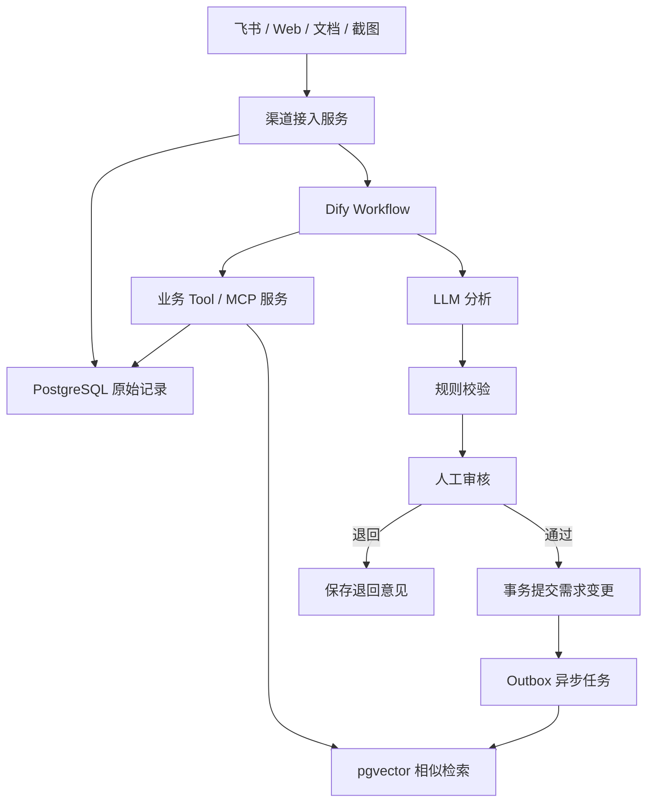

# 多渠道需求管理 Agent：稳定工程实施方案

> 版本：1.0  
> 目标：将现有 Dify Demo 演进为可持续开发、可测试、可审计、可恢复的工程系统。

## 1. 建设目标

系统需要形成以下闭环：

1. 从飞书消息、手工文本、产品文档和截图接收需求。
2. 保存输入渠道、提交人、原始文本、原始文件、输入时间和渠道扩展信息。
3. 使用普通数据库进行精确查询，使用 pgvector 进行语义相似需求召回。
4. 使用 LLM 提取需求、判断重复/关联/冲突、评估风险并生成版本建议。
5. 由人工完成最终审核，LLM 不直接修改业务数据。
6. 审核通过后以事务方式创建或更新需求及版本。
7. 将已生效需求异步同步为向量索引。
8. 支持按需求编号、版本、时间、提交人、渠道、功能和语义进行检索。

## 2. 总体技术方案

| 层次 | 推荐技术 | 职责 |
| --- | --- | --- |
| 渠道接入层 | FastAPI Webhook、上传 API | 接收飞书、文本、文档、截图 |
| 流程编排层 | Dify Workflow | LLM 调用、条件分支、人工审核、工具编排 |
| 能力服务层 | Python 3.12、FastAPI、FastMCP、Pydantic v2 | 封装查询、审核提交、版本管理、向量检索工具 |
| 业务数据层 | PostgreSQL 16 | 保存原始记录、主需求、版本、审核、审计 |
| 向量索引层 | PostgreSQL + pgvector | 保存需求向量并进行相似度检索 |
| 文件存储层 | MinIO / S3 | 保存 PDF、Word、图片等原始文件 |
| 异步任务层 | PostgreSQL Outbox + Worker | Embedding、向量同步、失败重试 |
| 模型层 | LLM + text-embedding-v4 | 需求分析和文本向量化 |

核心原则：

- PostgreSQL 业务表是唯一事实来源。
- pgvector 是可根据业务表重建的派生索引。
- Dify 负责流程编排，不承担业务事务。
- MCP/REST 只是调用协议，核心业务规则必须放在应用服务层。
- LLM 只生成建议，所有写操作由系统规则校验并经过人工审核。

## 3. 系统架构



### 3.1 部署边界

建议将数据分为三个独立边界：

1. **Dify 自身数据库**：只由 Dify 管理，不让业务代码依赖其内部表。
2. **需求业务数据库**：由需求管理服务管理，可使用独立 PostgreSQL 数据库或独立 Schema。
3. **需求向量表**：可与业务数据库部署在同一 PostgreSQL 实例中，但使用独立 Schema 和最小权限账号。

即使 Dify 已自动创建 `embedding_vector_index_*` 表，自研服务也不应直接依赖这些内部表名，因为 Dify 升级时内部结构可能变化。

## 4. 推荐代码仓库结构

```text
requirement-agent/
├── apps/
│   ├── api/                 # 渠道接入、查询、审核 API
│   ├── mcp/                 # MCP HTTP 适配器
│   └── worker/              # Outbox、Embedding、重试任务
├── src/
│   ├── domain/              # 实体、枚举、领域规则
│   ├── application/         # 用例和事务编排
│   ├── infrastructure/
│   │   ├── db/              # PostgreSQL Repository
│   │   ├── vector/          # pgvector Repository
│   │   ├── embedding/       # Embedding 服务适配器
│   │   ├── storage/         # MinIO/S3 适配器
│   │   └── channels/        # 飞书等渠道适配器
│   └── interfaces/
│       ├── http/            # FastAPI 路由
│       └── mcp/             # MCP tools
├── migrations/              # Alembic 数据库迁移
├── tests/
│   ├── unit/
│   ├── integration/
│   └── e2e/
├── deploy/
│   ├── docker-compose.yml
│   └── env.example
├── pyproject.toml
└── README.md
```

HTTP API 与 MCP Tool 必须调用同一组 `application` 用例，不能各自实现一套业务逻辑。

## 5. 核心数据模型

建议使用 `BIGINT IDENTITY`、`TIMESTAMPTZ`、外键、唯一约束和状态约束。

### 5.1 原始需求记录

```sql
CREATE TABLE requirement_source (
    id BIGINT GENERATED ALWAYS AS IDENTITY PRIMARY KEY,
    idempotency_key TEXT NOT NULL UNIQUE,
    source_type TEXT NOT NULL,
    source_event_id TEXT,
    requester_id TEXT,
    requester_name TEXT,
    original_text TEXT,
    extracted_text TEXT,
    original_payload JSONB NOT NULL DEFAULT '{}',
    metadata JSONB NOT NULL DEFAULT '{}',
    processing_status TEXT NOT NULL DEFAULT 'received'
        CHECK (processing_status IN (
            'received', 'extracting', 'analyzing', 'pending_review',
            'approved', 'rejected', 'committed', 'failed'
        )),
    error_message TEXT,
    submitted_at TIMESTAMPTZ NOT NULL,
    created_at TIMESTAMPTZ NOT NULL DEFAULT NOW(),
    updated_at TIMESTAMPTZ NOT NULL DEFAULT NOW()
);

CREATE UNIQUE INDEX uq_requirement_source_channel_event
ON requirement_source(source_type, source_event_id)
WHERE source_event_id IS NOT NULL;
```

`idempotency_key` 用来防止飞书重复推送或客户端超时重试造成重复入库。

### 5.2 原始附件

```sql
CREATE TABLE requirement_attachment (
    id BIGINT GENERATED ALWAYS AS IDENTITY PRIMARY KEY,
    source_id BIGINT NOT NULL REFERENCES requirement_source(id),
    file_name TEXT NOT NULL,
    content_type TEXT NOT NULL,
    object_uri TEXT NOT NULL,
    file_hash TEXT NOT NULL,
    file_size BIGINT NOT NULL,
    extraction_status TEXT NOT NULL DEFAULT 'pending',
    created_at TIMESTAMPTZ NOT NULL DEFAULT NOW(),
    UNIQUE (source_id, file_hash)
);
```

附件本体存储在 MinIO/S3，数据库只保存地址与校验信息。

### 5.3 需求主表

```sql
CREATE SEQUENCE requirement_key_seq START 1;

CREATE TABLE requirement_master (
    id BIGINT GENERATED ALWAYS AS IDENTITY PRIMARY KEY,
    requirement_key TEXT NOT NULL UNIQUE,
    requirement_name TEXT NOT NULL,
    final_requirement TEXT NOT NULL,
    current_version INTEGER NOT NULL DEFAULT 0 CHECK (current_version >= 0),
    status TEXT NOT NULL DEFAULT 'active'
        CHECK (status IN ('active', 'archived', 'deleted')),
    lock_version INTEGER NOT NULL DEFAULT 0,
    created_at TIMESTAMPTZ NOT NULL DEFAULT NOW(),
    updated_at TIMESTAMPTZ NOT NULL DEFAULT NOW()
);
```

需求编号只能由服务端生成：

```sql
SELECT 'REQ-' || LPAD(nextval('requirement_key_seq')::TEXT, 6, '0');
```

不能让 LLM 生成编号，也不能使用 `MAX + 1`。

### 5.4 需求版本表

```sql
CREATE TABLE requirement_version (
    id BIGINT GENERATED ALWAYS AS IDENTITY PRIMARY KEY,
    requirement_id BIGINT NOT NULL REFERENCES requirement_master(id),
    parent_version_id BIGINT REFERENCES requirement_version(id),
    version_no INTEGER NOT NULL CHECK (version_no > 0),
    version_title TEXT NOT NULL,
    change_type TEXT NOT NULL
        CHECK (change_type IN ('new', 'add', 'modify', 'delete')),
    requirement_snapshot TEXT NOT NULL,
    change_summary TEXT NOT NULL,
    diff_payload JSONB NOT NULL DEFAULT '{}',
    created_by TEXT NOT NULL,
    reviewed_by TEXT NOT NULL,
    created_at TIMESTAMPTZ NOT NULL DEFAULT NOW(),
    UNIQUE (requirement_id, version_no)
);
```

每个版本保存完整快照；`diff_payload` 只用于展示变化，不能代替完整快照。

### 5.5 版本来源关联

```sql
CREATE TABLE requirement_version_source (
    version_id BIGINT NOT NULL REFERENCES requirement_version(id),
    source_id BIGINT NOT NULL REFERENCES requirement_source(id),
    relation_type TEXT NOT NULL DEFAULT 'source'
        CHECK (relation_type IN ('source', 'related', 'conflict')),
    PRIMARY KEY (version_id, source_id, relation_type)
);
```

不要使用逗号拼接的 `source_record_ids TEXT`。

### 5.6 人工审核记录

```sql
CREATE TABLE requirement_review (
    id BIGINT GENERATED ALWAYS AS IDENTITY PRIMARY KEY,
    source_id BIGINT NOT NULL REFERENCES requirement_source(id),
    analysis_snapshot JSONB NOT NULL,
    decision TEXT NOT NULL
        CHECK (decision IN ('approved', 'rejected', 'returned', 'timeout')),
    reviewer_id TEXT NOT NULL,
    reviewer_name TEXT,
    review_comment TEXT,
    edited_requirement TEXT,
    created_at TIMESTAMPTZ NOT NULL DEFAULT NOW()
);
```

人工修改后的文本以 `edited_requirement` 为准，并保留原始 LLM 分析快照。

### 5.7 领域审计日志

```sql
CREATE TABLE audit_event (
    id BIGINT GENERATED ALWAYS AS IDENTITY PRIMARY KEY,
    trace_id TEXT NOT NULL,
    event_type TEXT NOT NULL,
    aggregate_type TEXT NOT NULL,
    aggregate_id TEXT,
    actor_type TEXT NOT NULL,
    actor_id TEXT,
    before_data JSONB,
    after_data JSONB,
    result_status TEXT NOT NULL,
    error_code TEXT,
    created_at TIMESTAMPTZ NOT NULL DEFAULT NOW()
);
```

审计日志记录重要状态变化，不重复保存每个 Dify 节点的全部敏感输入。

### 5.8 Outbox 事件

```sql
CREATE TABLE outbox_event (
    id BIGINT GENERATED ALWAYS AS IDENTITY PRIMARY KEY,
    event_type TEXT NOT NULL,
    aggregate_id BIGINT NOT NULL,
    payload JSONB NOT NULL,
    status TEXT NOT NULL DEFAULT 'pending'
        CHECK (status IN ('pending', 'processing', 'succeeded', 'failed')),
    retry_count INTEGER NOT NULL DEFAULT 0,
    next_retry_at TIMESTAMPTZ,
    last_error TEXT,
    created_at TIMESTAMPTZ NOT NULL DEFAULT NOW(),
    processed_at TIMESTAMPTZ
);
```

### 5.9 向量索引表

以下以 `text-embedding-v4` 的 1024 维配置为例：

```sql
CREATE EXTENSION IF NOT EXISTS vector;

CREATE TABLE requirement_embedding (
    id BIGINT GENERATED ALWAYS AS IDENTITY PRIMARY KEY,
    requirement_id BIGINT NOT NULL REFERENCES requirement_master(id),
    version_id BIGINT NOT NULL REFERENCES requirement_version(id),
    requirement_key TEXT NOT NULL,
    content TEXT NOT NULL,
    functional_modules JSONB NOT NULL DEFAULT '[]',
    embedding_model TEXT NOT NULL,
    embedding_dimension INTEGER NOT NULL,
    content_hash TEXT NOT NULL,
    embedding vector(1024) NOT NULL,
    is_current BOOLEAN NOT NULL DEFAULT TRUE,
    created_at TIMESTAMPTZ NOT NULL DEFAULT NOW(),
    updated_at TIMESTAMPTZ NOT NULL DEFAULT NOW(),
    UNIQUE (requirement_id, version_id)
);

CREATE INDEX idx_requirement_embedding_hnsw
ON requirement_embedding
USING hnsw (embedding vector_cosine_ops);

CREATE INDEX idx_requirement_embedding_current
ON requirement_embedding(requirement_id, is_current);
```

更换 Embedding 模型或维度时，应创建新索引版本并重新生成全部向量，不能将不同模型的向量混合比较。

## 6. 领域状态和规则

### 6.1 原始需求状态

```text
received
→ extracting
→ analyzing
→ pending_review
├─ approved → committed
├─ rejected
└─ failed → retry
```

### 6.2 LLM 允许输出的动作

```text
new | add | modify | delete
```

系统必须再次校验：

- `new` 不允许携带已有目标需求 ID。
- `add/modify/delete` 必须指向存在且为 active 的需求。
- `proposed_final_requirement` 不能为空。
- `delete` 必须明确删除范围，不能只返回空文本。
- 关联需求必须真实存在。
- LLM 返回的数据库 ID、需求编号和版本号不能直接信任。

## 7. MCP / Tool 接口设计

查询可以拆分，写入必须按业务事务聚合。

### 7.1 推荐工具列表

| 工具 | 类型 | 用途 |
| --- | --- | --- |
| `get_source_record` | 只读 | 获取已保存的原始输入 |
| `retrieve_requirement_context` | 只读 | 合并精确查询与向量召回 |
| `get_requirement` | 只读 | 获取主需求和当前版本 |
| `get_requirement_versions` | 只读 | 分页获取历史版本 |
| `search_requirements` | 只读 | 按时间、人员、渠道、功能等检索 |
| `validate_change_proposal` | 只读 | 对 LLM 建议进行确定性校验 |
| `approve_and_commit_change` | 写入 | 审核通过后单事务提交 |
| `reject_source_record` | 写入 | 保存退回或拒绝原因 |
| `retry_vector_index` | 管理 | 重试指定需求的向量同步 |

不要向 LLM 暴露 `create_master`、`create_version`、`update_master` 三个可独立调用的写工具。

### 7.2 统一工具响应

```json
{
  "ok": true,
  "code": "OK",
  "message": "success",
  "data": {},
  "trace_id": "..."
}
```

失败响应示例：

```json
{
  "ok": false,
  "code": "VERSION_CONFLICT",
  "message": "需求已被其他审核任务更新，请重新分析",
  "data": {
    "expected_version": 4,
    "actual_version": 5
  },
  "trace_id": "..."
}
```

### 7.3 审核提交请求

```json
{
  "source_id": 26,
  "review_id": 18,
  "decision": "approved",
  "reviewer_id": "user-1001",
  "review_comment": "确认通过",
  "expected_requirement_id": 3,
  "expected_current_version": 4,
  "proposal": {
    "action": "modify",
    "target_requirement_key": "REQ-000003",
    "requirement_name": "车机空调快捷控制",
    "final_requirement": "...",
    "change_summary": "新增后挡除雾开关"
  },
  "idempotency_key": "workflow-run-id:approved"
}
```

### 7.4 `approve_and_commit_change` 事务流程

```text
BEGIN
→ 根据幂等键检查是否已经执行
→ 锁定 requirement_source
→ 校验审核记录和审核人权限
→ new：服务端生成 requirement_key 并创建主需求
→ existing：SELECT requirement_master FOR UPDATE
→ 校验 expected_current_version
→ 计算 next_version
→ 创建完整版本快照
→ 更新 requirement_master
→ 创建版本来源关联
→ 更新 requirement_source = committed
→ 写 audit_event
→ 写 outbox_event(requirement.version.committed)
COMMIT
```

向量调用不放在这个事务内。

## 8. 检索设计

### 8.1 精确检索

普通数据库负责：

- 需求编号；
- 版本号；
- 创建时间和更新时间范围；
- 提交人；
- 输入渠道；
- 状态；
- 功能模块；
- 来源记录。

### 8.2 语义检索

```sql
SELECT requirement_id,
       version_id,
       requirement_key,
       content,
       1 - (embedding <=> :query_vector) AS similarity
FROM requirement_embedding
WHERE is_current = TRUE
ORDER BY embedding <=> :query_vector
LIMIT :top_k;
```

服务端限制：

- `top_k` 默认 5，最大 20；
- 设置最低相似度阈值；
- 只召回 active/current 数据；
- 返回候选 ID 后，从业务表重新读取完整数据；
- 向 LLM 传递的上下文总长度必须有上限。

### 8.3 混合召回

建议同时使用：

1. PostgreSQL 全文/关键词匹配；
2. pgvector 语义相似度；
3. 需求编号和模块精确匹配。

将候选去重后返回给 LLM。LLM 不能仅凭相似度分数直接判定重复。

## 9. 向量异步同步

Worker 处理 `requirement.version.committed`：

1. 读取对应版本的完整快照。
2. 拼接稳定的向量化文本。
3. 计算 `content_hash`。
4. 如果哈希和模型未变化，则跳过重复生成。
5. 调用 Embedding 服务。
6. 校验返回维度为 1024。
7. 将同一需求的旧向量标记为 `is_current = false`。
8. Upsert 当前版本向量。
9. 标记 Outbox 成功。

建议向量化内容：

```text
需求名称：{requirement_name}
功能模块：{functional_modules}
需求摘要：{summary}
最终需求：{requirement_snapshot}
```

失败策略：

- 指数退避重试，例如 1、5、15、60 分钟；
- 达到最大次数后标记 `failed`；
- 提供人工重试工具；
- 向量失败不影响已审核需求的业务状态；
- 页面显示 `index_pending/indexed/index_failed`。

## 10. Dify 工作流设计

建议将“录入审核”和“需求检索”拆成两个工作流。

### 10.1 需求录入审核工作流

```text
Start(source_id)
→ Tool: get_source_record
→ 文档解析/OCR结果汇总
→ Tool: retrieve_requirement_context
→ LLM: 输出结构化分析建议
→ Tool: validate_change_proposal
→ IF 校验通过
    → Human Input: 展示审核报告
        ├─ Approved → Tool: approve_and_commit_change
        ├─ Rejected → Tool: reject_source_record
        └─ Timeout → Tool: 保存超时状态并通知
→ End
```

LLM 节点使用固定 JSON Schema，并开启主模型重试和备用模型分支。主、备用模型必须使用相同 Schema，之后通过变量聚合器汇总。

### 10.2 需求检索工作流

```text
Start(filters, query_text)
→ Tool: search_requirements
→ 输出主需求表或历史版本表
→ 可选：LLM 生成结果摘要
→ End
```

检索结果本身不应依赖 LLM，避免 LLM 对数据库内容进行遗漏或改写。

## 11. 多渠道接入设计

### 11.1 标准输入信封

所有渠道统一转换为：

```json
{
  "idempotency_key": "feishu:message-id",
  "source_type": "feishu_message",
  "source_event_id": "message-id",
  "requester": {
    "id": "ou_xxx",
    "name": "张三"
  },
  "submitted_at": "2026-09-02T08:30:00+08:00",
  "text": "原始需求",
  "attachments": [],
  "metadata": {
    "chat_id": "oc_xxx"
  }
}
```

### 11.2 渠道适配器职责

- 验证签名和来源；
- 解析渠道事件；
- 下载附件到对象存储；
- 生成幂等键；
- 保存原始记录；
- 触发 Dify 工作流；
- 不执行需求合并和版本判断。

新增渠道只需要实现新的适配器，并输出标准输入信封。

## 12. 安全设计

必须落实：

- MCP Server 使用 Bearer Token、OAuth 或内网认证；
- Dify 只能访问受控工具，不能获取数据库超级用户账号；
- 查询工具和写入工具使用不同数据库角色；
- 文件下载使用短期签名 URL；
- 飞书 Webhook 验证签名、防重放；
- API Key、数据库密码只通过 Secret/环境变量注入；
- 审计日志对 Token、手机号和附件地址脱敏；
- 人工审核校验用户身份与角色；
- 限制附件大小、类型并进行安全扫描；
- 所有外部输入都进行长度和类型校验。

建议数据库角色：

```text
requirement_reader   # 只读检索
requirement_writer   # 通过业务函数写入
requirement_worker   # 只处理 outbox 和向量表
migration_owner      # 仅迁移时使用
```

## 13. 可观测性与审计

每次请求生成全局 `trace_id`，贯穿：

```text
渠道事件 → API → Dify run → MCP tool → PostgreSQL → Worker
```

重点监控指标：

- 各渠道接入成功率；
- 文档解析失败率；
- LLM 响应时间和结构化输出失败率；
- 待审核数量及等待时长；
- 事务提交失败率和版本冲突次数；
- Outbox 积压量；
- Embedding 调用成功率和费用；
- pgvector 检索延迟和召回数量；
- 主模型切换备用模型次数。

日志不得输出完整 API Key、Token、数据库密码或含敏感信息的原始附件。

## 14. 错误处理策略

| 故障 | 处理方式 |
| --- | --- |
| 渠道重复推送 | 通过幂等键直接返回已有记录 |
| 文件解析失败 | 保存错误，允许重新解析 |
| LLM 超时/限流 | 节点重试后切换备用模型 |
| LLM Schema 不合法 | 拒绝进入人工审核并重试分析 |
| 人工审核超时 | 保存 timeout，不自动入库 |
| 版本并发冲突 | 回滚事务，要求重新分析最新版本 |
| 数据库暂时不可用 | 工具返回可重试错误，不重复写入 |
| Embedding 不可用 | 业务提交成功，Outbox 后台重试 |
| pgvector 检索失败 | 降级为关键词和结构化查询 |
| MCP 不可用 | Dify 走异常分支并保存任务状态 |

## 15. 测试方案

### 15.1 单元测试

- `new/add/modify/delete` 规则校验；
- 最终需求生成结果检查；
- 版本号计算；
- 状态机非法跳转；
- 向量文本拼接和内容哈希；
- LLM 输出 Schema 校验。

### 15.2 数据库集成测试

- 新需求同时创建主表和 v1；
- 已有需求生成下一版本；
- 任意 SQL 失败时事务整体回滚；
- 两个并发请求只能有一个创建 vN；
- 相同幂等键不会重复写入；
- 版本来源关联完整；
- 向量 Upsert 不产生重复行。

### 15.3 端到端测试

至少覆盖：

1. 手工文本新建需求并审核通过。
2. 产品文档解析后创建需求。
3. 截图 OCR 后进入审核。
4. 飞书相同事件重复发送。
5. 新需求与已有需求重复。
6. 新需求与已有需求相关但不冲突。
7. 审核退回并保存意见。
8. 主 LLM 故障后切换备用模型。
9. Embedding 服务故障后恢复并补齐索引。
10. 按版本、时间、提交人、渠道和功能查询。
11. 使用语义不同但含义相近的文本命中 pgvector。
12. 并发审核同一需求时触发版本冲突。

## 16. 开发阶段划分

### 阶段一：数据与事务基础

- 创建独立业务数据库和迁移脚本；
- 实现 Repository 与事务；
- 实现原始记录、需求、版本、审核、审计表；
- 实现 `approve_and_commit_change`；
- 完成幂等和并发测试。

完成标准：不接 LLM 也能通过固定测试数据完成审核和版本提交。

### 阶段二：查询与 pgvector

- 接入 `text-embedding-v4`；
- 创建向量表和 HNSW 索引；
- 实现 Outbox Worker；
- 实现关键词、结构化和语义混合检索；
- 验证 Embedding 失败后的恢复。

完成标准：数据库版本提交不依赖 Embedding，恢复后能自动补齐向量。

### 阶段三：Dify 与 MCP

- 暴露只读和写入工具；
- 使用 HTTP 传输接入 Dify；
- 配置结构化 LLM、备用模型和变量聚合器；
- 接入人工审核；
- 完成端到端测试。

完成标准：Dify 不持有 SQL 权限，审核通过才能调用事务提交工具。

### 阶段四：渠道与展示

- 接入飞书 Webhook；
- 接入文档和截图解析；
- 完成需求主表、历史版本、来源及审核页面；
- 增加全部筛选条件；
- 完成角色权限和操作审计。

完成标准：满足三项原始业务需求并通过验收测试。

## 17. 验收标准

### 17.1 多渠道输入

- 支持文本、文档、截图和飞书消息；
- 每条输入都能追溯渠道、人员、时间、原文和附件；
- 重复渠道事件不会产生重复记录；
- 新增渠道不修改核心版本业务。

### 17.2 版本管理与检索

- 新需求创建主表和 v1；
- 增删改只创建新版本，不覆盖历史；
- 主表始终指向最新有效版本；
- 每个版本可以追溯一个或多个原始来源；
- 支持按编号、版本、时间、人员、渠道、模块和语义检索；
- 可以查看完整历史快照和版本差异。

### 17.3 LLM 与人工审核

- LLM 输出重复、关联、冲突、风险和版本建议；
- 相似候选同时来自精确查询和 pgvector；
- LLM 不能直接获得数据库写权限；
- 未经人工审核不能修改主需求；
- 通过、退回、拒绝、超时均可审计；
- 主模型故障可切换备用模型。

## 18. 关键决策总结

1. **保留 Dify**：继续负责 LLM 和人工审核编排。
2. **增加独立业务服务**：所有数据库规则从 Dify 脚本迁入应用服务。
3. **MCP 可用但不强依赖**：固定工作流也可通过 OpenAPI Tool 调用相同服务。
4. **合并写工具**：所有审核通过后的业务写入由一个事务工具完成。
5. **PostgreSQL 是事实源**：pgvector 仅作为可重建索引。
6. **向量异步生成**：Embedding 故障不阻塞需求入库。
7. **服务端生成需求编号与版本号**：不信任 LLM 提供的标识。
8. **来源使用关联表**：不再保存逗号拼接 ID。
9. **模型和维度固定版本化**：避免向量不兼容。
10. **先完成数据事务，再接 LLM 和渠道**：降低开发风险。

## 19. 官方参考

- Dify 工具与外部 MCP Server：https://docs.dify.ai/en/cloud/use-dify/workspace/tools
- Dify Tool 节点：https://docs.dify.ai/en/cloud/use-dify/nodes/tools
- Dify 外部知识库：https://docs.dify.ai/en/cloud/use-dify/knowledge/connect-external-knowledge-base
- Dify 环境变量与 pgvector：https://docs.dify.ai/en/self-host/deploy/configuration/environments

